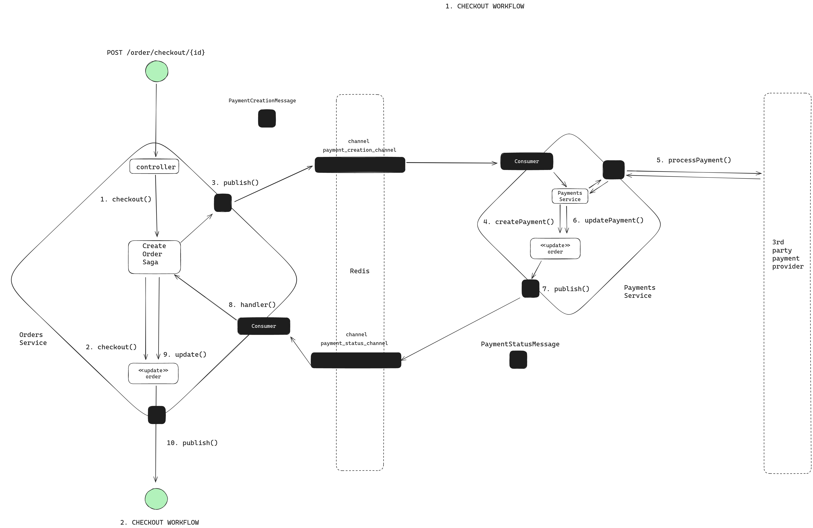
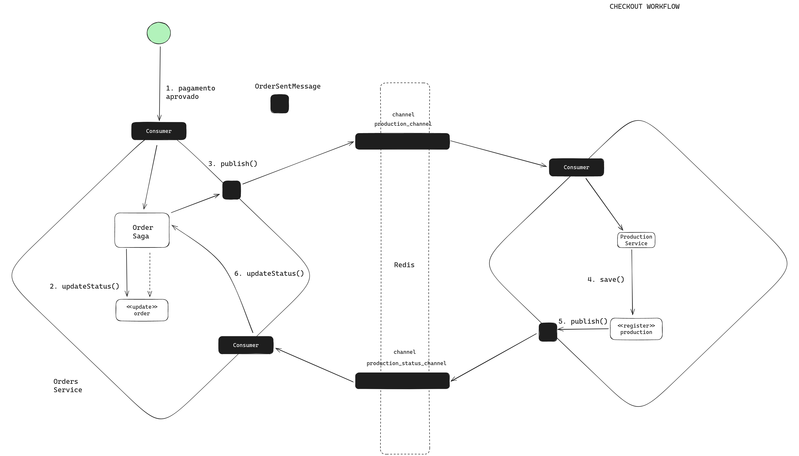
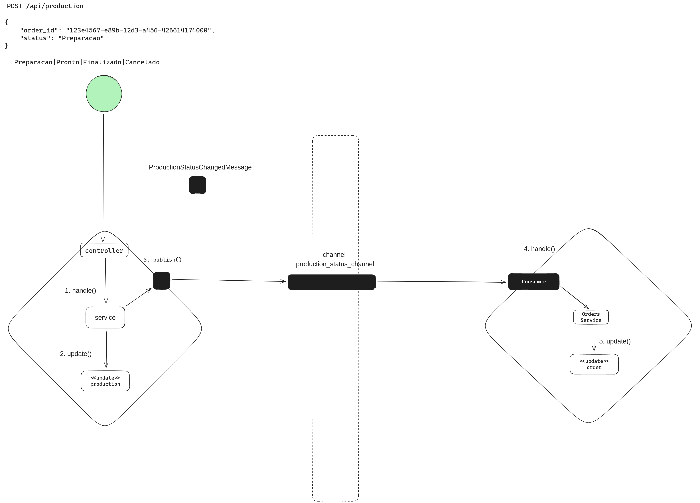

# Padrão SAGA

## Descrição

Neste arquivo explicaremos o padrão SAGA escolhido por nossa solução e como ele foi implementado.

### Modelo SAGA Orquestrado

Escolhemos seguir com o modelo SAGA **Orquestrado**. Este modelo é composto por um serviço orquestrador que coordena a
execução de várias etapas de um processo de negócio. Cada etapa é executada por um serviço de domínio diferente. O
orquestrador é responsável por garantir que todas as etapas sejam executadas com sucesso e na ordem correta.

Notamos que nossas necessidades de negócio e pré estruturação dos serviços eram muito bem atendidas por este modelo. A
estruturação de nossos serviços em domínios bem definidos e a necessidade de garantir a execução de etapas de negócio
em ordem correta e com sucesso nos levou a escolher este modelo.

Neste contexto nosso serviço orquestrador é o `msvc-orders` tendo etapas de negócio nele mesmo e também nos
serviços `msvc-payment` e `msvc-production`, nestes ultimos sempre repassando informações de suas próprias execuções
de volta ao `msvc-orders` para que este possa garantir a execução correta das etapas.

Como requisitado na tarefa o padrão SAGA passa a valer apenas a partir do checkout, ou seja, a partir do momento que o
cliente finaliza a criação do pedido e passa para seu pagamento.

### Nossa Infra

Escolhemos por manter o uso do **_Redis_** como solução para **Pub/Sub** e para armazenamento de dados em estruturas não
relacionais nos serviços `msvc-payments` e `msvc-production`. O Redis é uma solução de alta performance e baixa latência
que em nosso contexto de POC/MVP se mostrou extremamente simples de implementar e usar, ao mesmo tempo que nos oferece
os recursos necessários para a implementação do padrão SAGA.

## Fluxogramas

### Checkout - Parte 1

1. **Checkout e criação da cobrança**

Após a criação do pedido, o cliente é redirecionado para uma página/fluxo de checkout em que confirma os dados do pedido
e sua intenção em partir para o passo de pagamento. Em nosso backend isso é representado por um POST
para `/orders/checkout/{id}` que é consumido pelo serviço `msvc-orders`.

O `msvc-orders` recebe esta informação, atualiza o status do pedido, cria um entidade payments própria em sua base
relacional e publica uma requisição de cobrança ao serviço `msvc-payment` e retorna um status 200 ao cliente.

Esta requisição de cobrança é feita no channel `payment_creation_channel` no formato de uma mensagem JSON chamada `
PaymentCreationMessage`.

O `msvc-payment` recebe esta mensagem, cria uma entidade de cobrança em sua base não relacional e simula o processo de
cobrança sendo feito por um _3rd Party_.

2. **Retorno de Pagamento**

Após a simulação de cobrança o `msvc-payment` publica uma mensagem de retorno de pagamento no
channel `payment_status_channel` no formato de uma mensagem JSON chamada `PaymentStatusMessage` que contém o ID do
pagamento
que sofreu atualização e para qual status ele foi. Isso é consumido pelo `msvc-orders` que da seguimento ao fluxo
identificado na
imagem `Checkout - Parte 2`.

### Checkout - Parte 2

1. **Atualização de Pedido**

Recebendo o retorno de pagamento o `msvc-orders` atualiza o status do pedido. O pagamento tendo sido aprovado, o pedido
é atualizado para `Pago` bem como a entidade de pagamento é atualizada com o status `Aprovado`. Caso o pagamento tenha
sido recusado o pedido é atualizado para `Recusado` e a entidade de pagamento é atualizada com o status `Recusado`.

2. **Criação de Produção**

Após a atualização do pedido o `msvc-orders` publica uma mensagem de criação de produção no channel `production_channel`
no formato de uma mensagem JSON chamada `OrderSentMessage` e atualiza o status do pedido para `Recebido`.
O `msvc-production`
recebe esta mensagem, cria uma entidade de produção em sua base não relacional e aguarda inputs de atualização de
status.

### Produção

1. **Criação de Produção**

Recebendo uma chamda POST para `/api/production` o `msvc-production` atualiza sua entidade de produção em sua base não
relacional e publica uma mensagem de atualização de produção no channel `production_status_channel` no formato de uma
mensagem JSON chamada `ProductionStatusChangedMessage` que contém o ID do pedido que sofreu atualização e para qual
status ele foi.

***Atenção***: Este fluxo aceita requisições POST para `api/production` simulando um ponto físico dentro da cozinha
que recebe a informação de alterações no processo de sua produção. Acreditamos que isso não quebra o **_SAGA_** pois
neste caso
o `msvc-production` atua como uma `bridge` entre um agente externo - que efetua alterações na produção - e o fluxo de
negócio
de produção, sempre repassando informações de suas próprias execuções de volta ao `msvc-orders` para que este possa
garantir
a execução correta das etapas e as medidas a serem tomadas.

## Fluxos de Exceção

### Pagamento Recusado

Caso o pagamento tenha sido recusado o mesmo processo de atualização de status de pagamento ocorre, descrito no item
`Checkout - Parte 1`. O `msvc-orders` recebe a notificação de atualização de status do pagamento, altera pedido
para `Recusado`, a entidade de pagamento é atualizada para `Recusado`, uma mensagem é enviada ao `msvc-production`
contendo
o mesmo status e o fluxo é encerrado. Entidades que passem para esse status não podem sofrer mais alterações de status.

### Pedido Cancelado

Caso o pedido seja cancelado o mesmo processo de atualização de status de pedido ocorre, descrito no item anterior porém
iniciado no fluxo do `msvc-orders`. O `msvc-orders` recebe o request DELETE e notifica os outros serviços para que
atualizem suas informações e encerra o fluxo.

## Conclusão

A implementação do padrão SAGA em nossa solução acrescentou confiabilidade nas nossas operações distribuidas, celeridade
nos processamentos e visibilidade aos fluxos. Conseguimos garantir a execução correta das etapas de negócio e consistência
nos registros dos diversos serviços constituintes.