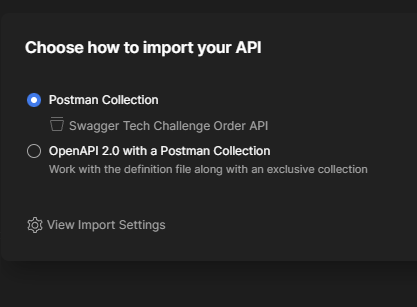
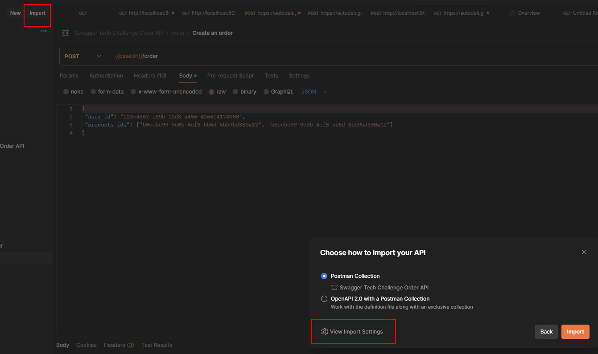
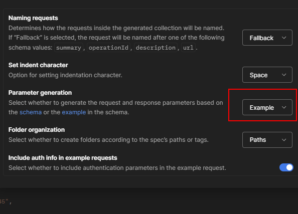
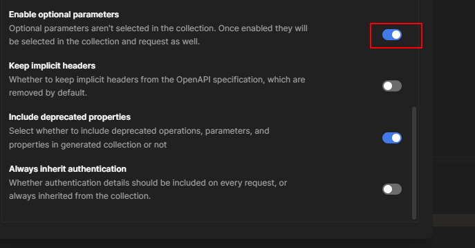

# How to import the swagger to Postman

1. Open Postman
2. Click on the Import button 

3. Select the "Import From Link" tab
4. Paste the link to the swagger documentation
    4.1. Example: http://localhost:8080/swagger/doc.json
5. click in the settings button

6. At the settings page, click in the Parameter Generation and Enable Optional Parameters toggle

[

This will generate the parameters for the requests based on the swagger documentation
